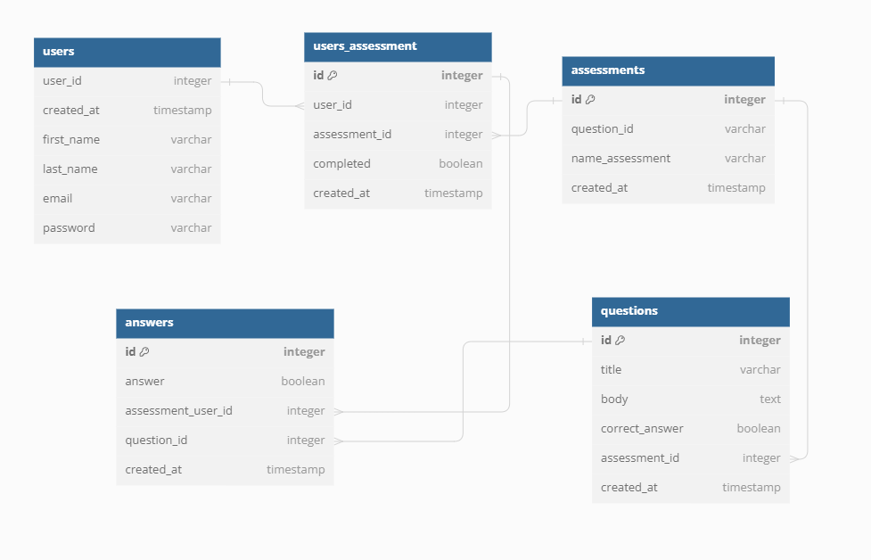

## Base URL

1. Make sure you have PostgreSQL server running. Create empty DataBase.
2. Create .env file with properties. See example .env.example file.
3. npm install
4. npm run db-migrate
5. npm run db-seed
6. npm run start
7. Open http://localhost:8000/swagger

